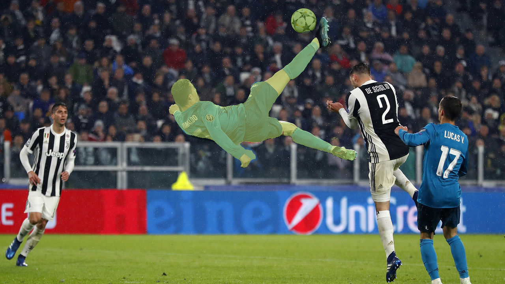

# Prompt-Engineering-For-Vision-Models

This repository contains code for tasks focusing on prompt engineering for vision models. Each task explores different aspects of image segmentation, object detection, and image generation using advanced machine learning models. Below are detailed descriptions of the tasks and their respective notebooks.

### 1. Image Segmentation Using Point and Bounding Box

This task demonstrates the application of image segmentation using a combination of point annotations and bounding boxes. The notebook illustrates how to leverage minimal user input to achieve precise segmentation results and provides code examples and visualizations to help understand the workflow and results. Key steps include:

- **Point Annotation**: Users provide points on the object of interest within the image.
- **Bounding Box**: Users draw bounding boxes around the target objects to refine the segmentation.
- **Segmentation Model**: The annotated data is fed into a segmentation model (FastSAM) that processes the image and generates a detailed mask of the object.

### 2. Zero-Shot Object Detection and Segmentation Using Text Prompt

This task covers advanced techniques in zero-shot object detection and segmentation, broken down into two different tasks:

#### a. Detecting Objects Using OWL-ViT and Generating Segmented Masks

This subtask utilizes the OWL-ViT (Vision Transformer for Open-World Localization) model to perform object detection and the Mobile-SAM model to perform segmentation without prior training on the specific objects. Key steps include:

- **Text Prompts**: Users provide textual descriptions of the objects they wish to detect.
- **Model Inference**: The OWL-ViT model uses these prompts to identify and locate objects within the image.
- **Segmentation**: The Mobile-SAM  generates masks for the detected objects, highlighting them within the image.

#### b. Blurring Out Detected Faces

This subtask focuses on privacy-preserving techniques by detecting and blurring faces in images. Key steps include:

- **Face Detection**: Using a pre-trained model to detect faces within the image.
- **Blurring**: Applying a blurring filter to the detected faces to anonymize them. After detecting faces I extracted the regions of the image containing faces based on the detected coordinates. Then I applied Gaussian blur technique to the extracted face regions. Finally I replaced the original face regions in the image with the blurred versions.

### 3. Image Generation using diffusion model

This task involves generating images using a diffusion model, with a specific focus on the Stable Diffusion inpainting pipeline. The primary goal is to transform random noise or partially masked images into coherent and visually appealing outputs based on textual prompts. The notebook provided outlines a comprehensive process from setting up the environment to experimenting with different model parameters.

- **Data Loading and Preprocessing**: I loaded an image from the movie "Dreamer" (2005) and defined bounding boxes to specify the region of interest. This region was used to generate binary masks that guide the inpainting process. Using the YOLO model for segmentation, I created masks for the selected area, visualized, and saved them. These masks Ire crucial for the inpainting process, providing the model with information on which parts of the image to modify.

- **Model Initialization**: I initialized the Stable Diffusion inpainting pipeline from Hugging Face's `diffusers` library, leveraging GPU acceleration for efficiency.

- **Image Generation**:

The image generation process began with a basic prompt, "a realistic green dragon," applied to the masked image. I used a predefined number of inference steps and logged the results using Comet for tracking and comparison. Subsequent experiments involved adjusting various hyperparameters:

1. **Number of Inference Steps**: I varied the number of diffusion steps to observe how it impacted the quality and detail of the generated images. For instance, increasing the number of steps generally improved image quality but also increased computation time.
   
2. **Guidance Scale**: I experimented with different guidance scales, which influence the adherence of the generated image to the provided prompt. A higher guidance scale tends to produce images that more closely match the prompt but may reduce diversity.

3. **Strength Parameter**: This parameter controls the degree to which the original image is altered. By adjusting the strength, I explored the balance betIen retaining original image features and introducing new elements from the prompt.

- **Negative Prompts**: I also introduced negative prompts to instruct the model on what not to generate. For example, using the negative prompt "cartoon" while asking for "a realistic green dragon" helped steer the model away from creating cartoonish features, emphasizing a more realistic style.

- **Logging and Experimentation**: Throughout the experiments, I used Comet to log parameters and results systematically. Logging facilitated a thorough analysis of how different settings affected the generated images, enabling a structured comparison of outcomes.
